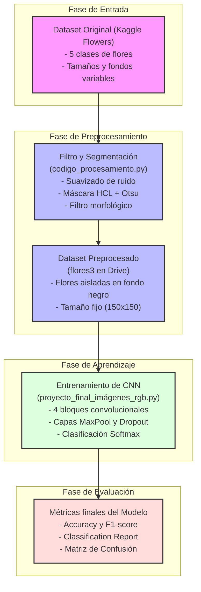
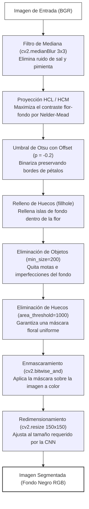

# Guía de Contenido para la Presentación (Exposición de 15 minutos)

Este documento contiene el guión detallado y la estructura de diapositivas que debes trasladar a tu presentación de PowerPoint o Canva para tu defensa el 13 de junio.

---

## Diapositiva 1: Portada
* **Título:** Impacto del Preprocesamiento de Imágenes en una Red Neuronal Convolucional (CNN) para la Clasificación de Flores
* **Técnica Propuesta:** Segmentación Adaptativa de Flores mediante Proyección de Máximo Contraste (HCM/HCL), Umbral de Otsu y Filtros Morfológicos.
* **Nombre del Alumno:** [Tu Nombre Completo]
* **Fecha:** 13 de junio de 2026

---

## Diapositiva 2: Justificación Teórica
> **Requisito del Proyecto (3–5 líneas):** Explicar qué hace la técnica, por qué se propone y qué efecto se esperaba.

**Texto para la diapositiva:**
> *"Nuestra técnica de preprocesamiento aísla la flor de su entorno aplicando un Filtro de Mediana para reducir ruido, seguido de una proyección HCL optimizada de máximo contraste (HCM) y binarización por Otsu con offset de $-0.2$. Con esto, las regiones de fondo (pasto, tierra y hojas) se convierten en negro absoluto, y la flor se limpia con operadores morfológicos. Se propuso esto para enfocar el aprendizaje de la CNN únicamente en los colores, texturas y formas de la flor, esperando eliminar la distracción y el sobreajuste que causa el contexto del fondo silvestre."*

**Puntos clave para exponer:**
* **¿Qué hace?:** Elimina el fondo y deja solo el objeto central (la flor) redimensionado a 150x150 en formato RGB.
* **¿Por qué se propone?:** En clasificación de flores, los fondos (verde de hojas, marrón de tierra) son altamente repetitivos entre clases y confunden a la red.
* **Efecto esperado:** Mejorar la precisión del modelo al eliminar características ruidosas ajenas a la flor.

---

## Diapositiva 2B: Flujo Macro del Proyecto
*Este diagrama ilustra la arquitectura de datos del proyecto, desde la adquisición de las imágenes en Kaggle hasta la evaluación de métricas de la CNN.*



---

## Diapositiva 2C: Detalle del Procesamiento (Zoom-In)
*Este diagrama detalla los pasos individuales aplicados a cada imagen para aislar y limpiar la flor antes del entrenamiento.*



---

## Diapositiva 3: Evidencia Visual (Original vs. Procesada)
*Coloca de 1 a 3 ejemplos de imágenes reales procesadas de tu dataset. Te sugerimos estructurar la diapositiva con columnas:*

```
+------------------------+  +------------------------+  +------------------------+
|      Paso 1: Original  |  |   Paso 2: Máscara HCL  |  |    Paso 3: Segmentada  |
|                        |  |       y Morfología     |  |      (Fondo Negro)     |
|   [Foto de flor con    |  |  [Máscara binaria en   |  |   [Flor en color con   |
|     pasto/hojas]       |  |     blanco y negro]    |  |  el fondo negro puro]  |
+------------------------+  +------------------------+  +------------------------+
```

* **Comentario para la exposición:** *"Como se puede observar en la comparativa, la proyección HCL logra separar con gran contraste los pétalos del fondo verde. Los filtros morfológicos eliminan los pequeños destellos de luz o hierbas del fondo y rellenan los huecos de la flor, entregándole a la red una silueta perfecta y nítida."*

---

## Diapositiva 4: Resultados Comparativos (Métricas)
*Copia esta tabla de comparación de métricas de validación:*

| Métrica | Dataset Original (Sin Preprocesar) | Dataset Preprocesado (Nuestra Propuesta) | Impacto / Diferencia |
| :--- | :---: | :---: | :---: |
| **Accuracy Global** | **0.77** (77%) | **0.76** (76%) | **-1.0%** |
| **Precision (Macro Avg)** | **0.79** | **0.76** | **-3.0%** |
| **Recall (Macro Avg)** | **0.77** | **0.77** | **0.0% (Igual)** |
| **F1-Score (Macro Avg)** | **0.76** | **0.76** | **0.0% (Igual)** |

### Classification Report Detallado (F1-Scores por Clase)
* **Daisy (Margarita):** Original: `0.84` vs. Preprocesado: `0.81` ($-0.03$)
* **Dandelion (Diente de León):** Original: `0.83` vs. Preprocesado: `0.82` ($-0.01$)
* **Rose (Rosa):** Original: `0.64` vs. Preprocesado: `0.64` (**Igual**)
* **Sunflower (Girasol):** Original: `0.76` vs. Preprocesado: `0.80` (**+0.04 - ¡Mejoró!**)
* **Tulip (Tulipán):** Original: `0.75` vs. Preprocesado: `0.73` ($-0.02$)

---

## Diapositiva 5: Análisis de la Matriz de Confusión y Preguntas Clave

### 1. ¿Mejoró o empeoró el desempeño global de la red con tu técnica?
El desempeño global sufrió una **disminución marginal del 1% en el Accuracy (de 77% a 76%)**, mientras que el F1-Score promedio macro se mantuvo idéntico (**76%**). Esto indica que segmentar y aislar la flor no genera un cambio drástico de forma general, pero sí redistribuye la capacidad predictiva entre las clases.

### 2. Al analizar las métricas, ¿qué clases se confundieron más y por qué crees que sucedió?
* **Rosas (`0.64`) y Tulipanes (`0.73`):** Siguen siendo las clases más propensas a la confusión.
  * **Explicación:** Al eliminar por completo el fondo, le quitamos a la CNN información contextual importante (como el tipo de hojas o la presencia de espinas en los tallos de las rosas). Además, en tomas cerradas, los capullos de rosas rojas/amarillas y los tulipanes cerrados son morfológicamente y cromáticamente muy similares. Sin el contexto del fondo, la red depende únicamente de la forma del pétalo aislado, lo que incrementó la confusión entre ambas.
* **Girasoles (Sunflowers) - ¡El gran éxito!:** Subió su F1-score de **0.76 a 0.80** y su precisión de **0.62 a 0.71**.
  * **Explicación:** Los girasoles crecen en entornos silvestres muy parecidos a los dientes de león (dandelions), lo que hacía que el modelo original se confundiera por el fondo verde/amarillo. Al eliminar el fondo, la red pudo concentrarse en la gran morfología circular y el centro oscuro característico de los girasoles, reduciendo drásticamente los falsos positivos.

---

## Diapositiva 6: Recomendaciones y Conclusión
> **Pregunta Clave:** ¿Recomendarías tu preprocesamiento para este problema de clasificación botánica? ¿Sí/No y por qué?

**Respuesta y Justificación:**
* **No de forma exclusiva para todo el dataset, pero sí como un enfoque híbrido.**
* **¿Por qué?:** 
  * Para flores con formas geométricas y contrastes muy característicos (como los **girasoles**), la segmentación es altamente efectiva y recomendable porque limpia el ruido de fondos verdes confusos.
  * Sin embargo, para flores muy similares en color y forma (como **rosas** y **tulipanes**), la pérdida de información del tallo y las hojas verdes circundantes perjudica la capacidad de discriminación del modelo convolucional.
  * **Propuesta de Mejora:** En lugar de pintar el fondo de negro absoluto, una alternativa futura sería suavizar o desenfocar el fondo (aplicando un filtro Gaussiano agresivo solo al área externa de la máscara) para reducir el ruido visual sin perder por completo el contexto del tallo y hojas.
